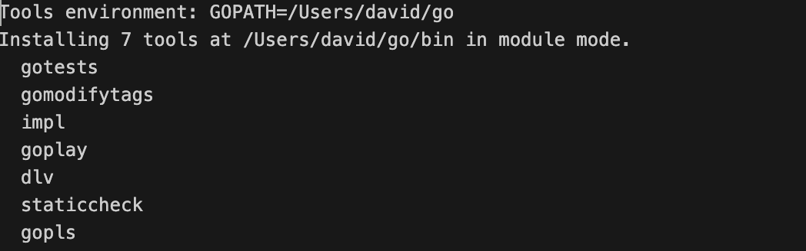

# Go开发环境搭建和基础命令

**Typora插入图片设置**


**Go版本 v1.18.8**

https://go.dev/dl/


**约定叫法**

```go
包名 -- package main
函数名 -- func main
目录名 --  demo/helloworld
代码文件名 -- main.go
```

# 1. Go编译器安装


```go
// 验证Go编译器安装成功

david@Davids-MBP ~ % go version
go version go1.18.8 darwin/amd64

// Go会默认安装到/usr/local目录下

david@Davids-MBP ~ % ls -l /usr/local/go  // $GOROOT
total 392
-rw-r--r--    1 root  wheel   56057  1 Nov  2022 AUTHORS
-rw-r--r--    1 root  wheel    1339  1 Nov  2022 CONTRIBUTING.md
-rw-r--r--    1 root  wheel  111408  1 Nov  2022 CONTRIBUTORS
-rw-r--r--    1 root  wheel    1479  1 Nov  2022 LICENSE
-rw-r--r--    1 root  wheel    1303  1 Nov  2022 PATENTS
-rw-r--r--    1 root  wheel    1475  1 Nov  2022 README.md
-rw-r--r--    1 root  wheel     397  1 Nov  2022 SECURITY.md
-rw-r--r--    1 root  wheel       8  1 Nov  2022 VERSION
drwxr-xr-x   24 root  wheel     768  1 Nov  2022 api
drwxr-xr-x    4 root  wheel     128  1 Nov  2022 bin
-rw-r--r--    1 root  wheel      52  1 Nov  2022 codereview.cfg
drwxr-xr-x    7 root  wheel     224  1 Nov  2022 doc
drwxr-xr-x    3 root  wheel      96  1 Nov  2022 lib
drwxr-xr-x   14 root  wheel     448  1 Nov  2022 misc
drwxr-xr-x    6 root  wheel     192  1 Nov  2022 pkg
drwxr-xr-x   69 root  wheel    2208  1 Nov  2022 src
drwxr-xr-x  354 root  wheel   11328  1 Nov  2022 test

david@Davids-MBP ~ % which go
/usr/local/go/bin/go

// Go的环境变量存放位置

david@Davids-MBP ~ % cat /etc/paths.d/go 
/usr/local/go/bin
```

# 2. VSCode配置

**安装VSCode的Go开发插件**


**设置代码自动保存**


**延迟0.5秒后自动保存**


**设置目录按照垂直层级显示**


**开启自动保存**


**设置目录层级间距更加明显**


# 3. `$GOPATH`和`$GOROOT`

`GOROOT`和`GOPATH`都是Go的环境变量，其中`GOROOT`是我们安装Go开发包的路。`GOROOT`存放了Go自带的源代码和依赖库。而从Go 1.8版本开始，Go开发包在安装完成后会为`GOPATH`设置一个默认目录(`/Users/david/go`)，并且在Go 1.14及之后的版本中启用了Go Module模式（1.16开始默认就是GO MODULE），所以从Go 1.14开始，就不一定非要将代码写到`GOPATH`目录下，所以也就**不需要我们再自己配置GOPATH**了，使用默认的即可。`GOPATH`目录在`GOMODULE`情况下就是用来存放下载的第三方库（`/Users/david/go/pkg/mod`）和第三方库安装后的二进制文件（`/Users/david/go/bin`）。

## 3.1 `GOPATH`

```go
// 早期的Go开发，需要在$GOPATH/src下存放项目代码，并且执行go run运行代码时，需要指明代码存放的路径。
// 目前都是基于GOMODULE开发，可以自定义代码存放的位置，无需所有代码都存到$GOPATH/src目录下。
```

```go
david@Davids-MBP ~ % go env
GO111MODULE=""    // GO111MODULE要改为on，表示使用Go MODULE进行包管理
GOARCH="amd64"
GOBIN=""
GOCACHE="/Users/david/Library/Caches/go-build"
GOENV="/Users/david/Library/Application Support/go/env"
GOEXE=""
GOEXPERIMENT=""
GOFLAGS=""
GOHOSTARCH="amd64"
GOHOSTOS="darwin"
GOINSECURE=""
GOMODCACHE="/Users/david/go/pkg/mod"
GONOPROXY=""
GONOSUMDB=""
GOOS="darwin"
GOPATH="/Users/david/go"        // 默认的GOPATH，该目录会在执行go get/install命令下载和安装Go的第三方依赖库时自动创建
GOPRIVATE=""
GOPROXY="https://proxy.golang.org,direct"
GOROOT="/usr/local/go"					// 默认的GOROOT，表示Go的安装路径
GOSUMDB="sum.golang.org"
GOTMPDIR=""
GOTOOLDIR="/usr/local/go/pkg/tool/darwin_amd64"
GOVCS=""
GOVERSION="go1.18.8"
GCCGO="gccgo"
GOAMD64="v1"
AR="ar"
CC="clang"
CXX="clang++"
CGO_ENABLED="1"
GOMOD="/dev/null"
GOWORK=""
CGO_CFLAGS="-g -O2"
CGO_CPPFLAGS=""
CGO_CXXFLAGS="-g -O2"
CGO_FFLAGS="-g -O2"
CGO_LDFLAGS="-g -O2"
PKG_CONFIG="pkg-config"
GOGCCFLAGS="-fPIC -arch x86_64 -m64 -pthread -fno-caret-diagnostics -Qunused-arguments -fmessage-length=0 -fdebug-prefix-map=/var/folders/52/3hss75k51b347pdrnbwg4zy80000gn/T/go-build1524620242=/tmp/go-build -gno-record-gcc-switches -fno-common"
```

`$GOPATH`下需要有三个目录，建议事先手动创建好

```go
src：存放GOPATH工程结构下编写的Go的源代码，比如：.go，.c等。将编写的代码存放在src目录下，执行go run，会在src目录下查找代码。如果不是在src目录下执行go run，那么要指明路径。
	- 执行代码时，要指定代码的绝对路径或者相对路径

bin：存放编译后生成的可执行文件，为了方便，可将此目录加入到$PATH变量中。如果有多个$GOPATH，那么需要把多个bin目录都添加到$PATH环境变量。通过go get/install下载并安装的插件二进制程序，会存到$GOPATH/bin目录。

	david@Davids-MBP ~ % ls -l /Users/david/go/bin
  total 161208
  -rwxr-xr-x  1 david  staff  15888608  2 Jul 01:19 dlv
  -rwxr-xr-x  1 david  staff   3180544  2 Jul 01:20 go-outline
  -rwxr-xr-x  1 david  staff   3265456  2 Jul 01:18 gomodifytags
  -rwxr-xr-x  1 david  staff   6729184  2 Jul 01:18 goplay
  -rwxr-xr-x  1 david  staff  24563032  2 Jul 01:20 gopls
  -rwxr-xr-x  1 david  staff  10029264  2 Jul 01:18 gotests
  -rwxr-xr-x  1 david  staff   5635104  2 Jul 01:18 impl
  -rwxr-xr-x  1 david  staff  12399200  2 Jul 01:19 staticcheck

pkg：存放编译后生成的静态库，比如：.a文件。多个静态库文件通过连接器连接，最终构成我们要得到的二进制可执行文件。

	david@Davids-MBP ~ % ls -l /Users/david/go/pkg 
  total 0
  drwxr-xr-x  9 david  staff  288  2 Jul 01:19 mod
  drwxr-xr-x  3 david  staff   96  2 Jul 01:17 sumdb
  david@Davids-MBP ~ % ls -l /Users/david/go/pkg/mod // go get下载的第三方依赖库会存到mod目录
  total 0
  drwxr-xr-x   4 david  staff  128  2 Jul 01:17 cache
  drwxr-xr-x  23 david  staff  736  2 Jul 01:20 github.com
  dr-xr-xr-x  20 david  staff  640  2 Jul 01:19 go.starlark.net@v0.0.0-20220816155156-cfacd8902214
  drwxr-xr-x   3 david  staff   96  2 Jul 01:17 golang.org
  drwxr-xr-x   3 david  staff   96  2 Jul 01:19 gopkg.in
  drwxr-xr-x   3 david  staff   96  2 Jul 01:19 honnef.co
  drwxr-xr-x   4 david  staff  128  2 Jul 01:19 mvdan.cc
```

```go
Go1.16开始默认使用GOMODULE工程结构，因此如果需要使用GOPATH，那么需要修改GO111MODULE变量

GOPATH：GO111MODULE=auto
GOMODULE：GO111MODULE=on
```

虽然大部分情况下，都是使用Go MODULE对Go的项目代码进行包管理，但是`GOPATH`在某些情况下还是会用。。所以，还要在`GOPATH`下手动创建三个目录。

```go
david@Davids-MBP ~ % mkdir /Users/david/go                  
david@Davids-MBP ~ % mkdir /Users/david/go/{src,bin,pkg}
david@Davids-MBP ~ % ls -l /Users/david/go 
total 0
drwxr-xr-x  2 david  staff  64  1 Jul 23:18 bin
drwxr-xr-x  2 david  staff  64  1 Jul 23:18 pkg
drwxr-xr-x  2 david  staff  64  1 Jul 23:18 src
```

## 3.2 `GOROOT`

`GOROOT`下也有src，bin，pkg三个目录

```go
bin：存放Go自带的二进制程序
pkg：存放Go自带的pkg
src：存放Go自带的依赖库
```

## 3.3 Go依赖包的查找顺序

```go
1. 当前项目的根目录
2. $GOPATH/pkg/mod 	  
3. $GOROOT/src       // 比如fmt包就是存在$GOROOT/src目录下
```

```go
go get下载的第三方依赖库会存到$GOPATH/pkg/mod目录。
go install会先把第三方依赖库下载到$GOPATH/pkg/mod目录，然后执行安装，安装好的可执行文件会存在$GOPATH/bin。这个bin目录会在执行go install时自动创建，也可以事先手动创建好。
```

## 3.4 设置环境变量

```go
// zsh的环境变量要在～/.zshrc文件中定义

david@Davids-MBP ~ % vim .zshrc
export GOPATH="/Users/david/go"
export GOROOT="/usr/local/go"
export GO111MODULE="on"
export PATH="$GOPATH/bin:$PATH"
david@Davids-MBP ~ % source .zshrc
david@Davids-MBP ~ % echo $PATH
/Users/david/go/bin:/Library/Frameworks/Python.framework/Versions/2.7/bin:/Library/Frameworks/Python.framework/Versions/3.8/bin:/usr/local/bin:/usr/bin:/bin:/usr/sbin:/sbin:/Applications/VMware Fusion.app/Contents/Public:/usr/local/go/bin
```

```go
david@Davids-MBP ~ % echo $GOPATH
/Users/david/go
david@Davids-MBP ~ % echo $GOROOT
/usr/local/go
david@Davids-MBP ~ % go env GO111MODULE

david@Davids-MBP ~ % go env -w GO111MODULE="on"
david@Davids-MBP ~ % go env GO111MODULE
on
david@Davids-MBP ~ % go env GOROOT     
/usr/local/go
david@Davids-MBP ~ % go env GOPATH
/Users/david/go
```

# 4. 项目初始化

## 4.1 Go第三方插件的安装

首次在VSCode编写Go代码时，右下角会提示安装Go的插件，此时点击`Install All`，等待安装即可。安装完会提示SUCCEED。





```go
david@Davids-MBP ~ % ls -l /Users/david/go/bin
total 161208
-rwxr-xr-x  1 david  staff  15888608  2 Jul 01:19 dlv
-rwxr-xr-x  1 david  staff   3180544  2 Jul 01:20 go-outline
-rwxr-xr-x  1 david  staff   3265456  2 Jul 01:18 gomodifytags
-rwxr-xr-x  1 david  staff   6729184  2 Jul 01:18 goplay
-rwxr-xr-x  1 david  staff  24563032  2 Jul 01:20 gopls
-rwxr-xr-x  1 david  staff  10029264  2 Jul 01:18 gotests
-rwxr-xr-x  1 david  staff   5635104  2 Jul 01:18 impl
-rwxr-xr-x  1 david  staff  12399200  2 Jul 01:19 staticcheck
david@Davids-MBP ~ % ls -l /Users/david/go/pkg
total 0
drwxr-xr-x  9 david  staff  288  2 Jul 01:19 mod
drwxr-xr-x  3 david  staff   96  2 Jul 01:17 sumdb
david@Davids-MBP ~ % ls -l /Users/david/go/pkg/mod 
total 0
drwxr-xr-x   4 david  staff  128  2 Jul 01:17 cache
drwxr-xr-x  23 david  staff  736  2 Jul 01:20 github.com
dr-xr-xr-x  20 david  staff  640  2 Jul 01:19 go.starlark.net@v0.0.0-20220816155156-cfacd8902214
drwxr-xr-x   3 david  staff   96  2 Jul 01:17 golang.org
drwxr-xr-x   3 david  staff   96  2 Jul 01:19 gopkg.in
drwxr-xr-x   3 david  staff   96  2 Jul 01:19 honnef.co
drwxr-xr-x   4 david  staff  128  2 Jul 01:19 mvdan.cc
david@Davids-MBP ~ % ls -l /Users/david/go/src    
```

## 4.2 Go项目的工程结构

使用`GOMODULE`工程结构，**必须在VSCode中打开项目的根目录**。如果打开的不是根目录，虽然可以正常`go build`执行代码，但是会出现图中报错。


## 4.3 项目初始化

1. 创建项目目录

```go
david@Davids-MBP ~ % cd Documents/Go_6/Code 
david@Davids-MBP Code % mkdir demo
david@Davids-MBP Code % ls
demo
```

2. 项目目录初始化

```go
// 使用go mod init module名，进行初始化
// module名，go代码文件名和项目的根目录的名称可以不同，没有直接联系
// 初始化时，要进入项目根目录执行
david@Davids-MBP Code % cd demo 
david@Davids-MBP demo % go mod init github.com/goeasy2022/demo
go: creating new go.mod: module github.com/goeasy2022/demo
david@Davids-MBP demo % ls
go.mod
david@Davids-MBP demo % cat go.mod 
module github.com/goeasy2022/demo

go 1.18 // 这个module名称就是该项目的module名
 
```

3. 在VSCode中打开项根目录

在VSCode中，需要打开项目的根目录， 而不是其他目录。


# 5. 第一个Go

1. 在根目录下创建`helloworld`目录，然后创建`main.go`文件

一般把存放main函数的代码文件，保存为main.go。这样使用代码的人可以轻易的找到main函数的存放位置。

**值得注意的是**：一个Go项目，只有一个main包和一个main函数作为程序入口。学习阶段可以在不同的目录中，都创建main包和main函数，来运行不同目录下的代码。

```go
package main  // Go的源文件开头必须使用package声名这个代码文件所属的包。包是Go代码分发的最基本单位。若该文件的代码需要运行，那么包名必须为main。一个Go项目，只能有一个main包，作为程序执行的入口。每个package包所处的文件名和文件所处的目录名，以及包所处的代码文件名可以不同。因为Go最终是通过module名，和包（package）名来查找依赖的。

import "fmt"  // 用于导入此代码程序依赖的包。这里的main程序依赖于fmt包。

func main() {   // main包作为程序的入口。
  							// func用于定义函数。main函数是程序的入口，若代码文件需要运行，必须声明main函数。main函数没有参数，也没有返回值。
	fmt.Println("Hello World!")
}
```

2. 代码的编译和执行

```go
// Go代码运行在VSCode中，一定要先把代码保存，然后再运行
// 默认编译后的文件会以go代码所在的目录名命名

david@Davids-MBP demo % cd helloworld 
david@Davids-MBP helloworld % go build   	   // 不指明编译后的文件名，那么会默认用代码所处的目录名   
david@Davids-MBP helloworld % ls
helloworld      main.go
david@Davids-MBP helloworld % ./helloworld 
Hello World!

// 也可以使用-o来指定编译后的文件名称

david@Davids-MBP helloworld % go build -o main // 指定编译后的文件名为main
david@Davids-MBP helloworld % ls
helloworld      main            main.go
david@Davids-MBP helloworld % ./main 
Hello World!
```

3. 学习阶段可以在同一个项目根目录下，创建多个目录，每个目录都可以有自己的package main和func main，这样就可以在每个目录下都运行代码，无需每次都会回到同一个main.go去执行代码。


```go
// var/main.go

package main

import "fmt"

func main() {
	var a int = 1
	var b int = 2
	fmt.Println(a + b)
}

david@Davids-MBP demo % go run var/main.go 
3
```

# 6. 包的引用

1. 在项目根目录下新建文件夹`sum`，并且在`sum`目录内创建`sum.go`文件。


```go
// package的名称可以自定义，但是在其他位置引用时需要import导入package所在的目录名。
// 在其他代码中调用该包内的函数时，需要import导入。导入的格式为MODULE/DIRNAME。DIRNAME为该package所在的目录名。
// 一般建议目录名，package名，代码文件名和函数名写成一样的名称，这样就不用专注于名称，更方便import导入。
package sum   

func Add(a int, b int) int {
	sum := a + b
	return sum
}
```

2. 在`helloworld/main.go`文件中调用`sum`包


```go
package main

import (
	"fmt"
	"github.com/goeasy2022/demo/sum"  // github.com/goeasy2022/demo是该项目初始化时指定的项目module名称，存放在go.mod文件里。sum是要引用的package所在的目录名。
)

func main() {
	fmt.Println("Hello World!")
	a := 1
	b := 2
  c := sum.Add(a, b)                  // sum.Add(a, b) package名.函数名
	fmt.Println(c)
}
```

3. 执行`helloworld/main.go`

```go
david@Davids-MBP helloworld % go run main.go 
Hello World!
3
```

4. 整理项目目录结构

一般一个项目只有一个main目录，作为入口。


```go
package main

import (
	"fmt"

	"github.com/goeasy2022/demo/sum"
	var1 "github.com/goeasy2022/demo/var"  // var是package var1所在的目录名，前面的var1是代码保存时自动补全的，表示这里引用的是package var1
)

func main() {
	fmt.Println("Hello World!")
	a := 1
	b := 2
	c := sum.Add(a, b)
	fmt.Println(c)
	var1.Mul(3, 4)   // 引用package var1中的Mul函数
}
```

```go
david@Davids-MBP helloworld % go run main.go
Hello World!
3
12
```

# 7. Go的基础命令

## 7.1 go build

```go
go build：用于编译&链接程序或包
常用参数说明：
-x：打印编译过程执行的命令，并完成编译和运行
-n：只打印编译过程中执行的命令，并不真正的执行编译操作
-work：保留编译过程生成的临时文件
-o：指定编译后的文件名
go build -o hello.exe main.go // hello.exe为生成的文件名，hello.go为需要编译的文件
./hello.exe										// Go编译生成的程序文件有x权限，所以可以直接./hello.exe执行代码
```

## 7.2 go get

go get用于下载Go的第三方依赖库，下载好的文件会存放到`$GOPATH/pkg/mod`目录下，但是并不会执行包的安装。

并且，执行go get时，必须进入到项目的根目录执行命令。

```go
david@Davids-MBP ~ % cd Documents/Go_6/Code/demo 
david@Davids-MBP demo % go get -u github.com/mailru/easyjson/  // go get下载包
go: downloading github.com/mailru/easyjson v0.7.7   
go: downloading github.com/josharian/intern v1.0.0
go: added github.com/josharian/intern v1.0.0
go: added github.com/mailru/easyjson v0.7.7
david@Davids-MBP demo % ls -l /Users/david/go/src            
david@Davids-MBP demo % ls -l /Users/david/go/pkg            
total 0
drwxr-xr-x  9 david  staff  288  2 Jul 01:19 mod
drwxr-xr-x  3 david  staff   96  2 Jul 01:17 sumdb
david@Davids-MBP demo % ls -l /Users/david/go/pkg/mod        
total 0
drwxr-xr-x   4 david  staff  128  2 Jul 01:17 cache
drwxr-xr-x  24 david  staff  768  2 Jul 14:03 github.com
dr-xr-xr-x  20 david  staff  640  2 Jul 01:19 go.starlark.net@v0.0.0-20220816155156-cfacd8902214
drwxr-xr-x   3 david  staff   96  2 Jul 01:17 golang.org
drwxr-xr-x   3 david  staff   96  2 Jul 01:19 gopkg.in
drwxr-xr-x   3 david  staff   96  2 Jul 01:19 honnef.co
drwxr-xr-x   4 david  staff  128  2 Jul 01:19 mvdan.cc
david@Davids-MBP demo % ls -l /Users/david/go/pkg/mod/github.com/mailru 
total 0
dr-xr-xr-x  22 david  staff  704  2 Jul 14:03 easyjson@v0.7.7
david@Davids-MBP demo % ls -l /Users/david/go/pkg/mod/github.com/josharian 
total 0
dr-xr-xr-x  12 david  staff  384  2 Jul 01:18 impl@v1.1.0
dr-xr-xr-x   7 david  staff  224  2 Jul 14:03 intern@v1.0.0
david@Davids-MBP demo % ls -l /Users/david/go/bin            // 可以看到，go get只会下载包，并不会安装包           
total 161208
-rwxr-xr-x  1 david  staff  15888608  2 Jul 01:19 dlv
-rwxr-xr-x  1 david  staff   3180544  2 Jul 01:20 go-outline
-rwxr-xr-x  1 david  staff   3265456  2 Jul 01:18 gomodifytags
-rwxr-xr-x  1 david  staff   6729184  2 Jul 01:18 goplay
-rwxr-xr-x  1 david  staff  24563032  2 Jul 01:20 gopls
-rwxr-xr-x  1 david  staff  10029264  2 Jul 01:18 gotests
-rwxr-xr-x  1 david  staff   5635104  2 Jul 01:18 impl
-rwxr-xr-x  1 david  staff  12399200  2 Jul 01:19 staticcheck
```

## 7.3 go install

go install用于安装第三方依赖库，执行go install会先执行go get，把第三方包下载到`$GOPATH/pkg/mod`目录下，然后执行install，安装包，并且存放到`$GOPATH/bin`目录。

```go
david@Davids-MBP demo % go install  github.com/mailru/easyjson/easyjson
david@Davids-MBP demo % ls -l /Users/david/go/bin                      
total 170864
-rwxr-xr-x  1 david  staff  15888608  2 Jul 01:19 dlv
-rwxr-xr-x  1 david  staff   4939936  2 Jul 14:04 easyjson   // go install安装的第三包程序
-rwxr-xr-x  1 david  staff   3180544  2 Jul 01:20 go-outline
-rwxr-xr-x  1 david  staff   3265456  2 Jul 01:18 gomodifytags
-rwxr-xr-x  1 david  staff   6729184  2 Jul 01:18 goplay
-rwxr-xr-x  1 david  staff  24563032  2 Jul 01:20 gopls
-rwxr-xr-x  1 david  staff  10029264  2 Jul 01:18 gotests
-rwxr-xr-x  1 david  staff   5635104  2 Jul 01:18 impl
-rwxr-xr-x  1 david  staff  12399200  2 Jul 01:19 staticcheck
david@Davids-MBP demo % ls -l /Users/david/go/src                      
david@Davids-MBP demo % ls -l /usr/local/go/bin  
total 34960
-rwxr-xr-x  1 root  wheel  14530384  1 Nov  2022 go
-rwxr-xr-x  1 root  wheel   3364912  1 Nov  2022 gofmt
```

## 7.4 go.mod

go.mod表示当前项目使用的module，以及下载并安装了的第三方库。

这里之所以会显示黄色波浪线是因为我们并没有在代码中使用这些库。这个黄色波浪线只是提示，并不会影响代码的编写和运行。


如果确认了不需要使用这些依赖的话，那么可以在PROBLEMS这里右键选择要删除的依赖，直接删除即可。


## 7.5 go.sum

`Golang`为了依赖的安全考虑，在`go.mod`的基础上引入了`go.sum`，`go.sum`文件的作用主要是记录项目依赖的`hash`值，防止被人修改。


我们可以看到，文件主要用于记录每个依赖包的哈希值，在构建时，如果本地的依赖包hash值与go.sum文件中记录得不一致，则会拒绝构建。

go.sum存在的意义在于，我们希望别人或者在别的环境中构建当前项目时所使用依赖包跟go.sum中记录的是完全一致的，从而达到一致构建的目的。

这里我先把这些hash删除，因为这两个依赖包只是为了演示go get和go install命令下载的。并不会使用。

# 8. 创建Github仓库

1. 在Macbook创建git用户

```bash
david@Davids-MBP ~ % git config --global user.name "david.wang"
david@Davids-MBP ~ % git config --global user.email "davidwang794@gmail.com"
david@Davids-MBP ~ % cat .gitconfig 
[user]
	name = david.wang
	email = davidwang794@gmail.com
```

2. 生成密钥对

```bash
david@Davids-MBP ~ % ssh-keygen 
Generating public/private rsa key pair.
Enter file in which to save the key (/Users/david/.ssh/id_rsa): 
Created directory '/Users/david/.ssh'.
Enter passphrase (empty for no passphrase): 
Enter same passphrase again: 
Your identification has been saved in /Users/david/.ssh/id_rsa.
Your public key has been saved in /Users/david/.ssh/id_rsa.pub.
The key fingerprint is:
SHA256:qFN2BOyucQNrnyEyKnD979DCunci3t0vtlg48Y5anEI david@Davids-MBP
The key's randomart image is:
+---[RSA 3072]----+
|     ..          |
|      ..         |
|     .  .        |
|    . .o         |
|   . +E S        |
|. + **=+ =       |
|.o +oB=+B o      |
|o   o+**.Bo      |
|.  .++o**.++.    |
+----[SHA256]-----+
```

3. 将公钥上传到Github账号


4. 在Github上创建项目


5. 在Macbook初始化项目目录


